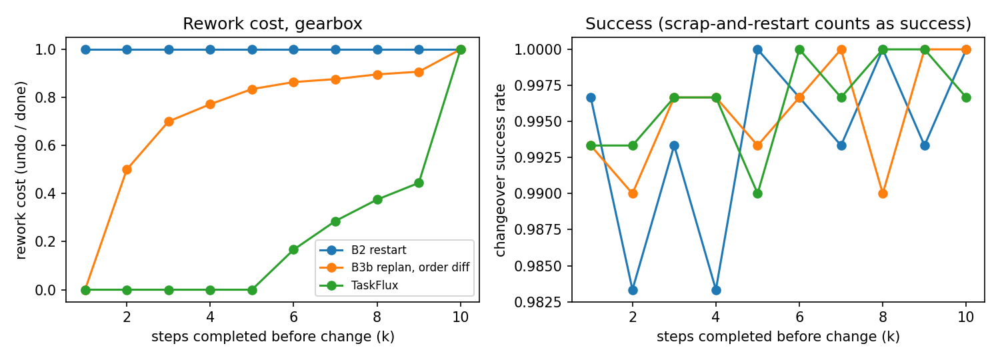
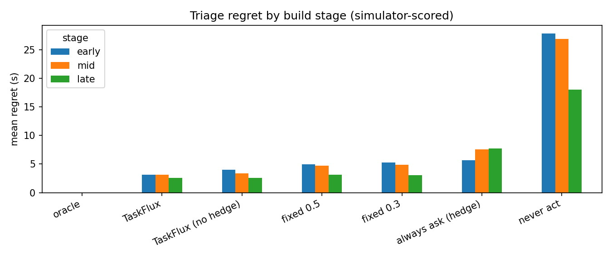
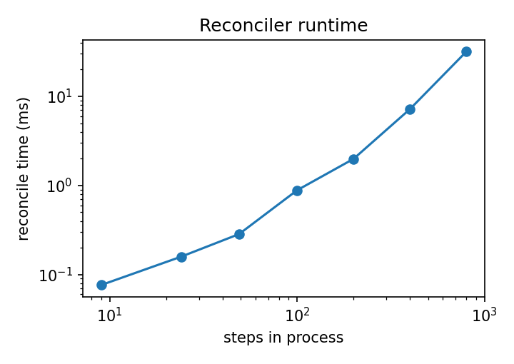
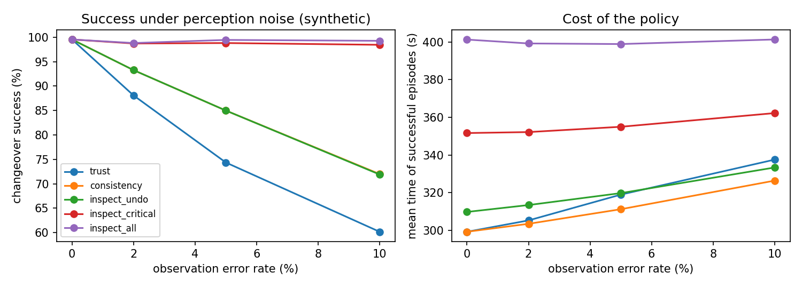

# Experiment results (generated by experiments/run_experiments.py)

Step-level simulation. Every number depends on the assumed parameters in `taskflux/sim.py` and is not a measurement of a physical robot or of OpenVLA. Success intervals are 95% Wilson. `CSR` counts a scrap-and-restart that ends in the right product as a success; `scrapped` and `destroyed` are reported next to it so that cost stays visible.

Produced by: python 3.12.7 on Windows 11; numpy==1.26.4, scipy==1.13.1, pandas==2.2.3, matplotlib==3.9.0, scikit-learn==1.5.2, pytest==8.4.2; git 8113f79 (uncommitted changes)

## E1. Changeover with the intent already known, four baselines

**gearbox, stage = truncation** (1500 episodes per system)

| system | n | CSR | rework (undo/done) | unneeded undos | scrapped | destroyed | AL s | TTP s | time s (successes) |
|---|---|---|---|---|---|---|---|---|---|
| B1 stock, ignore change | 1500 | 0.0% [0-0] | 0.00 | 0.00 | 0% | 0% | - | - | - |
| B2 restart | 1500 | 99.1% [99-99] | 1.00 | 2.76 | 6% | 6% | 0.8 | 51.1 | 232 |
| B3a replan, no reconciler | 1500 | 99.7% [99-100] | 0.00 | 0.00 | 0% | 0% | 1.3 | 1.3 | 152 |
| B3b replan, order diff | 1500 | 99.4% [99-100] | 0.56 | 1.82 | 7% | 7% | 1.3 | 46.5 | 218 |
| TaskFlux | 1500 | 99.4% [99-100] | 0.00 | 0.00 | 0% | 0% | 1.4 | 1.4 | 153 |

**gearbox, stage = undo** (1200 episodes per system)

| system | n | CSR | rework (undo/done) | unneeded undos | scrapped | destroyed | AL s | TTP s | time s (successes) |
|---|---|---|---|---|---|---|---|---|---|
| B1 stock, ignore change | 1200 | 0.0% [0-0] | 0.00 | 0.00 | 0% | 0% | - | - | - |
| B2 restart | 1200 | 99.6% [99-100] | 1.00 | 4.36 | 15% | 15% | 0.8 | 145.3 | 326 |
| B3a replan, no reconciler | 1200 | 0.0% [0-0] | 0.00 | 0.00 | 0% | 0% | - | - | - |
| B3b replan, order diff | 1200 | 99.7% [99-100] | 0.89 | 3.48 | 16% | 16% | 1.4 | 140.9 | 314 |
| TaskFlux | 1200 | 99.9% [100-100] | 0.32 | 0.00 | 0% | 0% | 1.4 | 38.6 | 162 |

**gearbox, stage = irreversible** (300 episodes per system)

| system | n | CSR | rework (undo/done) | unneeded undos | scrapped | destroyed | AL s | TTP s | time s (successes) |
|---|---|---|---|---|---|---|---|---|---|
| B1 stock, ignore change | 300 | 0.0% [0-1] | 0.00 | 0.00 | 0% | 0% | - | - | - |
| B2 restart | 300 | 100.0% [99-100] | 1.00 | 0.00 | 100% | 0% | 0.8 | 151.3 | 330 |
| B3a replan, no reconciler | 300 | 0.0% [0-1] | 0.00 | 0.00 | 0% | 0% | - | - | - |
| B3b replan, order diff | 300 | 100.0% [99-100] | 1.00 | 0.00 | 100% | 100% | 1.3 | 176.3 | 357 |
| TaskFlux | 300 | 99.7% [98-100] | 1.00 | 0.00 | 100% | 0% | 0.9 | 151.4 | 331 |

**synthetic, stage = truncation** (1215 episodes per system)

| system | n | CSR | rework (undo/done) | unneeded undos | scrapped | destroyed | AL s | TTP s | time s (successes) |
|---|---|---|---|---|---|---|---|---|---|
| B1 stock, ignore change | 1215 | 0.0% [0-0] | 0.00 | 0.00 | 0% | 0% | - | - | - |
| B2 restart | 1215 | 99.3% [99-100] | 1.00 | 1.36 | 14% | 3% | 0.8 | 58.9 | 284 |
| B3a replan, no reconciler | 1215 | 99.1% [98-99] | 0.00 | 0.00 | 0% | 0% | 1.4 | 1.4 | 197 |
| B3b replan, order diff | 1215 | 99.3% [99-100] | 0.44 | 0.69 | 7% | 7% | 1.4 | 31.3 | 241 |
| TaskFlux | 1215 | 99.7% [99-100] | 0.00 | 0.00 | 0% | 0% | 1.4 | 1.4 | 196 |

**synthetic, stage = undo** (7509 episodes per system)

| system | n | CSR | rework (undo/done) | unneeded undos | scrapped | destroyed | AL s | TTP s | time s (successes) |
|---|---|---|---|---|---|---|---|---|---|
| B1 stock, ignore change | 7509 | 0.0% [0-0] | 0.00 | 0.00 | 0% | 0% | - | - | - |
| B2 restart | 7509 | 99.4% [99-100] | 1.00 | 1.51 | 28% | 9% | 0.8 | 143.5 | 369 |
| B3a replan, no reconciler | 7509 | 0.0% [0-0] | 0.00 | 0.00 | 0% | 0% | 1.4 | 1.4 | - |
| B3b replan, order diff | 7509 | 99.3% [99-99] | 0.92 | 1.36 | 25% | 25% | 1.4 | 146.0 | 364 |
| TaskFlux | 7509 | 99.5% [99-100] | 0.62 | 0.00 | 7% | 7% | 1.4 | 85.8 | 271 |

**synthetic, stage = risky** (975 episodes per system)

| system | n | CSR | rework (undo/done) | unneeded undos | scrapped | destroyed | AL s | TTP s | time s (successes) |
|---|---|---|---|---|---|---|---|---|---|
| B1 stock, ignore change | 975 | 0.0% [0-0] | 0.00 | 0.00 | 0% | 0% | - | - | - |
| B2 restart | 975 | 99.6% [99-100] | 1.00 | 1.02 | 36% | 22% | 0.8 | 244.3 | 470 |
| B3a replan, no reconciler | 975 | 0.0% [0-0] | 0.00 | 0.00 | 0% | 0% | 1.3 | 1.3 | - |
| B3b replan, order diff | 975 | 99.3% [99-100] | 0.98 | 0.89 | 36% | 36% | 1.4 | 262.5 | 486 |
| TaskFlux | 975 | 99.3% [99-100] | 1.00 | 0.00 | 100% | 0% | 0.9 | 151.4 | 377 |

**synthetic, stage = irreversible** (3501 episodes per system)

| system | n | CSR | rework (undo/done) | unneeded undos | scrapped | destroyed | AL s | TTP s | time s (successes) |
|---|---|---|---|---|---|---|---|---|---|
| B1 stock, ignore change | 3501 | 0.0% [0-0] | 0.00 | 0.00 | 0% | 0% | - | - | - |
| B2 restart | 3501 | 99.5% [99-100] | 1.00 | 0.00 | 100% | 0% | 0.8 | 151.3 | 375 |
| B3a replan, no reconciler | 3501 | 0.0% [0-0] | 0.00 | 0.00 | 0% | 0% | 1.3 | 1.3 | - |
| B3b replan, order diff | 3501 | 99.5% [99-100] | 1.00 | 0.50 | 100% | 100% | 1.4 | 217.0 | 441 |
| TaskFlux | 3501 | 99.3% [99-100] | 1.00 | 0.00 | 100% | 0% | 0.9 | 151.4 | 375 |

## E2. Triage under classifier uncertainty

Intent classifier on held-out templates: accuracy 88.8%, ECE 0.054 after temperature scaling (T = 0.55).

Stop requests that reach the halt threshold: classifier alone 88.5%, with the lexical override 100.0%. Non-stop utterances that halt anyway: classifier alone 0.0%, with the override 0.0%.

Regret is scored by the step simulator (seconds lost against the best response in the true world), not by the formulas that drive the decision. All rows use the lexical override.

| policy | mean regret (s) | early | mid | late | ask % | unsafe (missed stop) |
|---|---|---|---|---|---|---|
| oracle | 0.0 +/- 0.0 | 0.0 | 0.0 | 0.0 | 8 | 0 |
| TaskFlux | 2.9 +/- 0.1 | 3.1 | 3.1 | 2.6 | 22 | 0 |
| TaskFlux (no hedge) | 3.3 +/- 0.1 | 4.0 | 3.4 | 2.6 | 21 | 0 |
| TaskFlux (no stop override) | 3.0 +/- 0.1 | 3.1 | 3.2 | 2.6 | 23 | 505 |
| fixed 0.5 | 4.2 +/- 0.2 | 5.0 | 4.7 | 3.1 | 7 | 0 |
| fixed 0.3 | 4.3 +/- 0.2 | 5.3 | 4.8 | 3.1 | 7 | 0 |
| always ask (idle) | 8.4 +/- 0.0 | 9.0 | 8.6 | 7.8 | 92 | 0 |
| always ask (hedge) | 7.1 +/- 0.0 | 5.7 | 7.6 | 7.7 | 92 | 0 |
| never act | 23.9 +/- 0.5 | 27.9 | 26.9 | 18.0 | 0 | 0 |

## E3. Hedged execution while confirmation is pending

| process set | states | states with a safe step | time saved if change (s, all states) | time saved if no change (s, all states) | worst case (s) | AL idle -> hedge (s) |
|---|---|---|---|---|---|---|
| gearbox | 9 | 44% | 2.7 | 2.7 | 0.00 | 7.4 -> 4.5 |
| synthetic | 2106 | 44% | 2.7 | 2.7 | 0.00 | 7.4 -> 4.5 |

## E4. Reconciler runtime

| steps | ms |
|---|---|
| 9.0 | 0.076 |
| 24.0 | 0.159 |
| 49.0 | 0.285 |
| 100.0 | 0.883 |
| 200.0 | 1.985 |
| 400.0 | 7.176 |
| 800.0 | 31.687 |

## E5. Sensitivity to the irreversible-step rate

| irreversible rate | system | n | success | scrapped | destroyed | mean time s |
|---|---|---|---|---|---|---|
| 0.0 | B2 restart | 1650 | 99% | 14% | 14% | 398 |
| 0.0 | B3b replan, order diff | 1650 | 99% | 12% | 12% | 377 |
| 0.0 | TaskFlux | 1650 | 100% | 23% | 6% | 293 |
| 0.1 | B2 restart | 1650 | 100% | 46% | 6% | 373 |
| 0.1 | B3b replan, order diff | 1650 | 99% | 45% | 45% | 390 |
| 0.1 | TaskFlux | 1650 | 100% | 44% | 3% | 310 |
| 0.25 | B2 restart | 1650 | 100% | 64% | 4% | 365 |
| 0.25 | B3b replan, order diff | 1650 | 100% | 60% | 60% | 384 |
| 0.25 | TaskFlux | 1650 | 100% | 52% | 2% | 318 |
| 0.4 | B2 restart | 1650 | 99% | 81% | 1% | 366 |
| 0.4 | B3b replan, order diff | 1650 | 99% | 79% | 79% | 391 |
| 0.4 | TaskFlux | 1650 | 99% | 66% | 1% | 332 |

## E1b. The same comparison on a second process (sensor module, examples/sensor_module.json)

**sensor_module, stage = truncation** (300 episodes per system)

| system | n | CSR | rework (undo/done) | unneeded undos | scrapped | destroyed | AL s | TTP s | time s (successes) |
|---|---|---|---|---|---|---|---|---|---|
| B1 stock, ignore change | 300 | 0.0% [0-1] | 0.00 | 0.00 | 0% | 0% | - | - | - |
| B2 restart | 300 | 100.0% [99-100] | 1.00 | 1.00 | 0% | 0% | 0.8 | 12.5 | 198 |
| B3a replan, no reconciler | 300 | 100.0% [99-100] | 0.00 | 0.00 | 0% | 0% | 1.3 | 1.3 | 176 |
| B3b replan, order diff | 300 | 99.7% [98-100] | 0.00 | 0.00 | 0% | 0% | 1.3 | 1.3 | 174 |
| TaskFlux | 300 | 99.7% [98-100] | 0.00 | 0.00 | 0% | 0% | 1.4 | 1.4 | 175 |

**sensor_module, stage = undo** (1500 episodes per system)

| system | n | CSR | rework (undo/done) | unneeded undos | scrapped | destroyed | AL s | TTP s | time s (successes) |
|---|---|---|---|---|---|---|---|---|---|
| B1 stock, ignore change | 1500 | 0.0% [0-0] | 0.00 | 0.00 | 0% | 0% | - | - | - |
| B2 restart | 1500 | 99.8% [99-100] | 1.00 | 1.27 | 33% | 33% | 0.8 | 140.8 | 327 |
| B3a replan, no reconciler | 1500 | 0.0% [0-0] | 0.00 | 0.00 | 0% | 0% | 1.4 | 1.4 | - |
| B3b replan, order diff | 1500 | 99.5% [99-100] | 0.79 | 0.60 | 32% | 32% | 1.3 | 132.9 | 311 |
| TaskFlux | 1500 | 99.8% [99-100] | 0.64 | 0.00 | 27% | 27% | 1.4 | 104.5 | 270 |

**sensor_module, stage = risky** (300 episodes per system)

| system | n | CSR | rework (undo/done) | unneeded undos | scrapped | destroyed | AL s | TTP s | time s (successes) |
|---|---|---|---|---|---|---|---|---|---|
| B1 stock, ignore change | 300 | 0.0% [0-1] | 0.00 | 0.00 | 0% | 0% | - | - | - |
| B2 restart | 300 | 99.7% [98-100] | 1.00 | 1.28 | 41% | 41% | 0.8 | 187.3 | 373 |
| B3a replan, no reconciler | 300 | 0.0% [0-1] | 0.00 | 0.00 | 0% | 0% | - | - | - |
| B3b replan, order diff | 300 | 99.3% [98-100] | 0.92 | 0.68 | 43% | 43% | 1.3 | 179.4 | 359 |
| TaskFlux | 300 | 99.7% [98-100] | 1.00 | 0.00 | 100% | 0% | 0.9 | 121.4 | 307 |

**sensor_module, stage = irreversible** (300 episodes per system)

| system | n | CSR | rework (undo/done) | unneeded undos | scrapped | destroyed | AL s | TTP s | time s (successes) |
|---|---|---|---|---|---|---|---|---|---|
| B1 stock, ignore change | 300 | 0.0% [0-1] | 0.00 | 0.00 | 0% | 0% | - | - | - |
| B2 restart | 300 | 100.0% [99-100] | 1.00 | 0.00 | 100% | 0% | 0.8 | 121.3 | 309 |
| B3a replan, no reconciler | 300 | 0.0% [0-1] | 0.00 | 0.00 | 0% | 0% | - | - | - |
| B3b replan, order diff | 300 | 99.7% [98-100] | 1.00 | 0.00 | 100% | 100% | 1.3 | 156.3 | 344 |
| TaskFlux | 300 | 100.0% [99-100] | 1.00 | 0.00 | 100% | 0% | 0.9 | 121.4 | 308 |

## E6. What each rule of the reconciler is worth (ablations)

Each row removes one rule. `no_refusal` attempts irreversible removals, `no_scrap_choice` never trades salvage against scrap on damage risk, `no_cascade` undoes only the forced roots, `no_cover_rule` ignores that a present cover blocks a step still to be built, `no_tolerated` removes harmless extras.

**gearbox, stage = truncation** (1000 episodes per variant)

| variant | n | CSR | collision | destroyed (unplanned) | wrong product | unneeded undos | time s (successes) |
|---|---|---|---|---|---|---|---|
| TaskFlux (full) | 1000 | 99.2% [98-100] | 0% | 0% | 0% | 0.00 | 154 |
| - no_refusal | 1000 | 99.3% [99-100] | 0% | 0% | 0% | 0.00 | 152 |
| - no_scrap_choice | 1000 | 99.9% [99-100] | 0% | 0% | 0% | 0.00 | 153 |
| - no_cascade | 1000 | 99.6% [99-100] | 0% | 0% | 0% | 0.00 | 153 |
| - no_cover_rule | 1000 | 0.0% [0-0] | 100% | 0% | 0% | 0.00 | - |
| - no_tolerated | 1000 | 99.4% [99-100] | 0% | 0% | 0% | 0.80 | 156 |

**gearbox, stage = undo** (800 episodes per variant)

| variant | n | CSR | collision | destroyed (unplanned) | wrong product | unneeded undos | time s (successes) |
|---|---|---|---|---|---|---|---|
| TaskFlux (full) | 800 | 99.6% [99-100] | 0% | 0% | 0% | 0.00 | 162 |
| - no_refusal | 800 | 99.8% [99-100] | 0% | 0% | 0% | 0.00 | 162 |
| - no_scrap_choice | 800 | 99.8% [99-100] | 0% | 0% | 0% | 0.00 | 161 |
| - no_cascade | 800 | 99.9% [99-100] | 0% | 0% | 0% | 0.00 | 162 |
| - no_cover_rule | 800 | 0.0% [0-0] | 100% | 0% | 0% | 0.00 | - |
| - no_tolerated | 800 | 99.6% [99-100] | 0% | 0% | 0% | 1.00 | 167 |

**gearbox, stage = irreversible** (200 episodes per variant)

| variant | n | CSR | collision | destroyed (unplanned) | wrong product | unneeded undos | time s (successes) |
|---|---|---|---|---|---|---|---|
| TaskFlux (full) | 200 | 99.0% [96-100] | 0% | 0% | 0% | 0.00 | 332 |
| - no_refusal | 200 | 99.5% [97-100] | 0% | 100% | 0% | 0.00 | 357 |
| - no_scrap_choice | 200 | 99.5% [97-100] | 0% | 0% | 0% | 0.00 | 329 |
| - no_cascade | 200 | 100.0% [98-100] | 0% | 100% | 0% | 0.00 | 356 |
| - no_cover_rule | 200 | 100.0% [98-100] | 0% | 0% | 0% | 0.00 | 333 |
| - no_tolerated | 200 | 99.5% [97-100] | 0% | 0% | 0% | 0.00 | 331 |

**sensor_module, stage = truncation** (200 episodes per variant)

| variant | n | CSR | collision | destroyed (unplanned) | wrong product | unneeded undos | time s (successes) |
|---|---|---|---|---|---|---|---|
| TaskFlux (full) | 200 | 100.0% [98-100] | 0% | 0% | 0% | 0.00 | 175 |
| - no_refusal | 200 | 99.5% [97-100] | 0% | 0% | 0% | 0.00 | 175 |
| - no_scrap_choice | 200 | 100.0% [98-100] | 0% | 0% | 0% | 0.00 | 175 |
| - no_cascade | 200 | 99.5% [97-100] | 0% | 0% | 0% | 0.00 | 173 |
| - no_cover_rule | 200 | 100.0% [98-100] | 0% | 0% | 0% | 0.00 | 174 |
| - no_tolerated | 200 | 99.0% [96-100] | 0% | 0% | 0% | 0.00 | 176 |

**sensor_module, stage = undo** (1000 episodes per variant)

| variant | n | CSR | collision | destroyed (unplanned) | wrong product | unneeded undos | time s (successes) |
|---|---|---|---|---|---|---|---|
| TaskFlux (full) | 1000 | 99.7% [99-100] | 0% | 27% | 0% | 0.00 | 270 |
| - no_refusal | 1000 | 99.7% [99-100] | 0% | 26% | 0% | 0.00 | 267 |
| - no_scrap_choice | 1000 | 99.9% [99-100] | 0% | 27% | 0% | 0.00 | 268 |
| - no_cascade | 1000 | 60.0% [57-63] | 40% | 12% | 0% | 0.00 | 248 |
| - no_cover_rule | 1000 | 49.5% [46-53] | 50% | 16% | 0% | 0.00 | 257 |
| - no_tolerated | 1000 | 99.8% [99-100] | 0% | 26% | 0% | 0.00 | 268 |

**sensor_module, stage = risky** (200 episodes per variant)

| variant | n | CSR | collision | destroyed (unplanned) | wrong product | unneeded undos | time s (successes) |
|---|---|---|---|---|---|---|---|
| TaskFlux (full) | 200 | 99.5% [97-100] | 0% | 0% | 0% | 0.00 | 308 |
| - no_refusal | 200 | 99.5% [97-100] | 0% | 36% | 0% | 0.00 | 308 |
| - no_scrap_choice | 200 | 99.5% [97-100] | 0% | 38% | 0% | 0.00 | 315 |
| - no_cascade | 200 | 3.0% [1-6] | 97% | 3% | 0% | 0.00 | 339 |
| - no_cover_rule | 200 | 16.5% [12-22] | 83% | 17% | 0% | 0.00 | 353 |
| - no_tolerated | 200 | 99.5% [97-100] | 0% | 0% | 0% | 0.00 | 307 |

**sensor_module, stage = irreversible** (200 episodes per variant)

| variant | n | CSR | collision | destroyed (unplanned) | wrong product | unneeded undos | time s (successes) |
|---|---|---|---|---|---|---|---|
| TaskFlux (full) | 200 | 100.0% [98-100] | 0% | 0% | 0% | 0.00 | 308 |
| - no_refusal | 200 | 100.0% [98-100] | 0% | 100% | 0% | 0.00 | 344 |
| - no_scrap_choice | 200 | 98.0% [95-99] | 0% | 0% | 0% | 0.00 | 306 |
| - no_cascade | 200 | 99.5% [97-100] | 0% | 100% | 0% | 0.00 | 343 |
| - no_cover_rule | 200 | 100.0% [98-100] | 0% | 0% | 0% | 0.00 | 306 |
| - no_tolerated | 200 | 98.5% [96-99] | 0% | 0% | 0% | 0.00 | 308 |

**synthetic, stage = truncation** (135 episodes per variant)

| variant | n | CSR | collision | destroyed (unplanned) | wrong product | unneeded undos | time s (successes) |
|---|---|---|---|---|---|---|---|
| TaskFlux (full) | 135 | 99.3% [96-100] | 0% | 0% | 0% | 0.00 | 200 |
| - no_refusal | 135 | 100.0% [97-100] | 0% | 0% | 0% | 0.00 | 198 |
| - no_scrap_choice | 135 | 99.3% [96-100] | 0% | 0% | 0% | 0.00 | 199 |
| - no_cascade | 135 | 100.0% [97-100] | 0% | 0% | 0% | 0.00 | 197 |
| - no_cover_rule | 135 | 49.6% [41-58] | 50% | 0% | 0% | 0.00 | 195 |
| - no_tolerated | 135 | 99.3% [96-100] | 0% | 1% | 0% | 0.05 | 207 |

**synthetic, stage = undo** (934 episodes per variant)

| variant | n | CSR | collision | destroyed (unplanned) | wrong product | unneeded undos | time s (successes) |
|---|---|---|---|---|---|---|---|
| TaskFlux (full) | 934 | 99.6% [99-100] | 0% | 8% | 0% | 0.00 | 270 |
| - no_refusal | 934 | 99.7% [99-100] | 0% | 7% | 0% | 0.00 | 270 |
| - no_scrap_choice | 934 | 99.3% [98-100] | 0% | 9% | 0% | 0.00 | 273 |
| - no_cascade | 934 | 68.6% [66-72] | 31% | 5% | 0% | 0.00 | 254 |
| - no_cover_rule | 934 | 37.6% [35-41] | 62% | 4% | 0% | 0.00 | 250 |
| - no_tolerated | 934 | 99.6% [99-100] | 0% | 8% | 0% | 0.05 | 270 |

**synthetic, stage = risky** (98 episodes per variant)

| variant | n | CSR | collision | destroyed (unplanned) | wrong product | unneeded undos | time s (successes) |
|---|---|---|---|---|---|---|---|
| TaskFlux (full) | 98 | 100.0% [96-100] | 0% | 0% | 0% | 0.00 | 383 |
| - no_refusal | 98 | 99.0% [94-100] | 0% | 16% | 0% | 0.00 | 428 |
| - no_scrap_choice | 98 | 100.0% [96-100] | 0% | 8% | 0% | 0.00 | 425 |
| - no_cascade | 98 | 13.3% [8-21] | 87% | 6% | 0% | 0.00 | 446 |
| - no_cover_rule | 98 | 8.2% [4-15] | 92% | 5% | 0% | 0.00 | 414 |
| - no_tolerated | 98 | 100.0% [96-100] | 0% | 0% | 0% | 0.00 | 384 |

**synthetic, stage = irreversible** (483 episodes per variant)

| variant | n | CSR | collision | destroyed (unplanned) | wrong product | unneeded undos | time s (successes) |
|---|---|---|---|---|---|---|---|
| TaskFlux (full) | 483 | 99.2% [98-100] | 0% | 0% | 0% | 0.00 | 375 |
| - no_refusal | 483 | 98.6% [97-99] | 0% | 100% | 0% | 0.00 | 432 |
| - no_scrap_choice | 483 | 99.0% [98-100] | 0% | 0% | 0% | 0.00 | 374 |
| - no_cascade | 483 | 56.3% [52-61] | 43% | 57% | 0% | 0.00 | 421 |
| - no_cover_rule | 483 | 73.3% [69-77] | 27% | 1% | 0% | 0.00 | 379 |
| - no_tolerated | 483 | 99.4% [98-100] | 0% | 0% | 0% | 0.00 | 374 |

## E7. Failure analysis

**How TaskFlux episodes end**

| source | stage | n | ok | scrapped_ok | destroyed then rebuilt | exec_failure (policy) | collision | wrong_product |
|---|---|---|---|---|---|---|---|---|
| gearbox | irreversible | 500 | 0 | 497 | 0 | 3 | 0 | 0 |
| gearbox | truncation | 2500 | 2483 | 0 | 0 | 17 | 0 | 0 |
| gearbox | undo | 2000 | 1996 | 0 | 0 | 4 | 0 | 0 |
| sensor_module | irreversible | 500 | 0 | 500 | 0 | 0 | 0 | 0 |
| sensor_module | risky | 500 | 0 | 498 | 0 | 2 | 0 | 0 |
| sensor_module | truncation | 500 | 499 | 0 | 0 | 1 | 0 | 0 |
| sensor_module | undo | 2500 | 2494 | 0 | 678 | 6 | 0 | 0 |
| synthetic | irreversible | 3984 | 0 | 3957 | 0 | 27 | 0 | 0 |
| synthetic | risky | 1073 | 0 | 1066 | 0 | 7 | 0 | 0 |
| synthetic | truncation | 1350 | 1345 | 0 | 0 | 5 | 0 | 0 |
| synthetic | undo | 8443 | 8403 | 0 | 573 | 40 | 0 | 0 |

**Steps most often responsible for an unrecovered TaskFlux failure** (a policy step that failed after its retries)

| source | outcome | failed_at | count |
|---|---|---|---|
| gearbox | exec_failure | adhesive_b | 3 |
| gearbox | exec_failure | label_b | 3 |
| gearbox | exec_failure | housing_b | 2 |
| gearbox | exec_failure | test_b | 2 |
| sensor_module | exec_failure | calibrate | 2 |
| sensor_module | exec_failure | lid_b | 2 |
| sensor_module | exec_failure | sensor | 2 |
| sensor_module | exec_failure | shield_can | 2 |

**Undos that destroyed a part under TaskFlux (then scrapped and rebuilt)**

| source | damaged_at | parts destroyed |
|---|---|---|
| sensor_module | header_a | 383 |
| sensor_module | shield_can | 295 |
| synthetic | a0 | 178 |
| synthetic | a1 | 117 |
| synthetic | a2 | 85 |
| synthetic | a3 | 52 |

**Time of successful episodes against the fastest baseline**

| source | stage | TaskFlux s | fastest other | TaskFlux slower by |
|---|---|---|---|---|
| gearbox | irreversible | 331 | B2 restart 330 s | 1.6 s |
| gearbox | truncation | 153 | B3a replan, no reconciler 152 s | 0.9 s |
| gearbox | undo | 162 | B3b replan, order diff 314 s | no (TaskFlux is fastest) |
| sensor_module | irreversible | 308 | B2 restart 309 s | no (TaskFlux is fastest) |
| sensor_module | risky | 307 | B3b replan, order diff 359 s | no (TaskFlux is fastest) |
| sensor_module | truncation | 175 | B3b replan, order diff 174 s | 0.7 s |
| sensor_module | undo | 270 | B3b replan, order diff 311 s | no (TaskFlux is fastest) |
| synthetic | irreversible | 375 | B2 restart 375 s | no (TaskFlux is fastest) |
| synthetic | risky | 378 | B2 restart 470 s | no (TaskFlux is fastest) |
| synthetic | truncation | 197 | B3a replan, no reconciler 197 s | no (TaskFlux is fastest) |
| synthetic | undo | 271 | B3b replan, order diff 364 s | no (TaskFlux is fastest) |

**States where TaskFlux is furthest behind restart** (positive = slower)

| source | k | B2 | TF | TF minus restart |
|---|---|---|---|---|
| gearbox | 10 | 329.7 | 331.3 | 1.6 |
| sensor_module | 8 | 309.4 | 307.6 | -1.8 |
| gearbox | 1 | 188.5 | 173.1 | -15.3 |
| sensor_module | 2 | 260.1 | 242.8 | -17.3 |
| gearbox | 2 | 192.5 | 173.6 | -18.9 |

## E8. Perception noise: acting on a state the verifier may have got wrong

Each step of the true state is independently misread with the stated error rate (a finished step seen as missing, and an unfinished one seen as done, both at that rate). Inspections are exact and cost 6 s each. Times are for successful episodes only, because failed episodes stop early and would look fast.

**gearbox**

| error rate | policy | n | CSR | collision | wrong product | inspections | time s (successes) |
|---|---|---|---|---|---|---|---|
| 0.0 | oracle | 600 | 99.3% [98-100] | 0.0% | 0.0% | 0.0 | 175 |
| 0.0 | trust | 600 | 100.0% [99-100] | 0.0% | 0.0% | 0.0 | 174 |
| 0.0 | consistency | 600 | 100.0% [99-100] | 0.0% | 0.0% | 0.0 | 174 |
| 0.0 | inspect_undo | 600 | 100.0% [99-100] | 0.0% | 0.0% | 1.0 | 180 |
| 0.0 | inspect_critical | 600 | 100.0% [99-100] | 0.0% | 0.0% | 5.1 | 204 |
| 0.0 | inspect_all | 600 | 100.0% [99-100] | 0.0% | 0.0% | 16.0 | 270 |
| 0.02 | trust | 600 | 85.2% [82-88] | 9.8% | 4.5% | 0.0 | 186 |
| 0.02 | consistency | 600 | 91.8% [89-94] | 5.2% | 2.5% | 0.4 | 180 |
| 0.02 | inspect_undo | 600 | 91.8% [89-94] | 5.2% | 2.5% | 1.4 | 185 |
| 0.02 | inspect_critical | 600 | 99.5% [99-100] | 0.0% | 0.0% | 5.6 | 209 |
| 0.02 | inspect_all | 600 | 99.5% [99-100] | 0.0% | 0.0% | 16.0 | 271 |
| 0.05 | trust | 600 | 72.8% [69-76] | 20.7% | 6.3% | 0.0 | 202 |
| 0.05 | consistency | 600 | 86.8% [84-89] | 9.0% | 4.0% | 1.2 | 184 |
| 0.05 | inspect_undo | 600 | 86.8% [84-89] | 9.0% | 4.0% | 2.1 | 190 |
| 0.05 | inspect_critical | 600 | 99.8% [99-100] | 0.0% | 0.0% | 6.2 | 212 |
| 0.05 | inspect_all | 600 | 99.8% [99-100] | 0.0% | 0.0% | 16.0 | 270 |
| 0.1 | trust | 600 | 57.2% [53-61] | 32.8% | 9.8% | 0.0 | 251 |
| 0.1 | consistency | 600 | 68.5% [65-72] | 24.2% | 7.2% | 2.1 | 202 |
| 0.1 | inspect_undo | 600 | 68.5% [65-72] | 24.2% | 7.2% | 2.9 | 207 |
| 0.1 | inspect_critical | 600 | 99.8% [99-100] | 0.0% | 0.0% | 7.5 | 219 |
| 0.1 | inspect_all | 600 | 99.8% [99-100] | 0.0% | 0.0% | 16.0 | 271 |

**sensor_module**

| error rate | policy | n | CSR | collision | wrong product | inspections | time s (successes) |
|---|---|---|---|---|---|---|---|
| 0.0 | oracle | 480 | 99.6% [98-100] | 0.0% | 0.0% | 0.0 | 266 |
| 0.0 | trust | 480 | 99.4% [98-100] | 0.0% | 0.0% | 0.0 | 261 |
| 0.0 | consistency | 480 | 99.4% [98-100] | 0.0% | 0.0% | 0.0 | 261 |
| 0.0 | inspect_undo | 480 | 99.4% [98-100] | 0.0% | 0.0% | 1.4 | 269 |
| 0.0 | inspect_critical | 480 | 99.4% [98-100] | 0.0% | 0.0% | 4.5 | 288 |
| 0.0 | inspect_all | 480 | 99.4% [98-100] | 0.0% | 0.0% | 13.0 | 339 |
| 0.02 | trust | 480 | 89.4% [86-92] | 8.1% | 1.9% | 0.0 | 271 |
| 0.02 | consistency | 480 | 94.8% [92-96] | 3.3% | 1.2% | 0.4 | 268 |
| 0.02 | inspect_undo | 480 | 94.8% [92-96] | 3.3% | 1.2% | 1.8 | 276 |
| 0.02 | inspect_critical | 480 | 99.4% [98-100] | 0.0% | 0.0% | 4.9 | 293 |
| 0.02 | inspect_all | 480 | 99.4% [98-100] | 0.0% | 0.0% | 13.0 | 342 |
| 0.05 | trust | 480 | 79.2% [75-83] | 14.0% | 6.5% | 0.0 | 278 |
| 0.05 | consistency | 480 | 89.6% [87-92] | 7.3% | 2.7% | 1.0 | 276 |
| 0.05 | inspect_undo | 480 | 89.6% [87-92] | 7.3% | 2.7% | 2.3 | 284 |
| 0.05 | inspect_critical | 480 | 99.6% [98-100] | 0.0% | 0.0% | 5.4 | 299 |
| 0.05 | inspect_all | 480 | 99.6% [98-100] | 0.0% | 0.0% | 13.0 | 345 |
| 0.1 | trust | 480 | 69.2% [65-73] | 22.5% | 8.3% | 0.0 | 288 |
| 0.1 | consistency | 480 | 81.9% [78-85] | 12.7% | 5.4% | 1.9 | 284 |
| 0.1 | inspect_undo | 480 | 81.9% [78-85] | 12.7% | 5.4% | 3.0 | 290 |
| 0.1 | inspect_critical | 480 | 100.0% [99-100] | 0.0% | 0.0% | 6.1 | 305 |
| 0.1 | inspect_all | 480 | 100.0% [99-100] | 0.0% | 0.0% | 13.0 | 346 |

**synthetic**

| error rate | policy | n | CSR | collision | wrong product | inspections | time s (successes) |
|---|---|---|---|---|---|---|---|
| 0.0 | oracle | 1100 | 99.5% [99-100] | 0.0% | 0.0% | 0.0 | 297 |
| 0.0 | trust | 1100 | 99.5% [99-100] | 0.0% | 0.0% | 0.0 | 299 |
| 0.0 | consistency | 1100 | 99.5% [99-100] | 0.0% | 0.0% | 0.0 | 299 |
| 0.0 | inspect_undo | 1100 | 99.5% [99-100] | 0.0% | 0.0% | 1.8 | 310 |
| 0.0 | inspect_critical | 1100 | 99.5% [99-100] | 0.0% | 0.0% | 8.7 | 352 |
| 0.0 | inspect_all | 1100 | 99.5% [99-100] | 0.0% | 0.0% | 17.0 | 401 |
| 0.02 | trust | 1100 | 88.1% [86-90] | 8.5% | 2.4% | 0.0 | 305 |
| 0.02 | consistency | 1100 | 93.3% [92-95] | 4.2% | 1.5% | 0.4 | 304 |
| 0.02 | inspect_undo | 1100 | 93.3% [92-95] | 4.2% | 1.5% | 2.1 | 313 |
| 0.02 | inspect_critical | 1100 | 98.7% [98-99] | 0.1% | 0.0% | 9.2 | 352 |
| 0.02 | inspect_all | 1100 | 98.8% [98-99] | 0.0% | 0.0% | 17.0 | 399 |
| 0.05 | trust | 1100 | 74.4% [72-77] | 18.4% | 6.7% | 0.0 | 319 |
| 0.05 | consistency | 1100 | 85.0% [83-87] | 9.1% | 5.4% | 0.9 | 311 |
| 0.05 | inspect_undo | 1100 | 85.0% [83-87] | 9.1% | 5.4% | 2.5 | 320 |
| 0.05 | inspect_critical | 1100 | 98.8% [98-99] | 0.1% | 0.5% | 9.6 | 355 |
| 0.05 | inspect_all | 1100 | 99.5% [99-100] | 0.0% | 0.0% | 17.0 | 399 |
| 0.1 | trust | 1100 | 60.2% [57-63] | 30.9% | 8.2% | 0.0 | 338 |
| 0.1 | consistency | 1100 | 72.0% [69-75] | 18.9% | 8.4% | 1.8 | 326 |
| 0.1 | inspect_undo | 1100 | 71.9% [69-74] | 19.0% | 8.4% | 3.3 | 333 |
| 0.1 | inspect_critical | 1100 | 98.5% [98-99] | 0.5% | 0.3% | 10.4 | 362 |
| 0.1 | inspect_all | 1100 | 99.3% [99-100] | 0.0% | 0.0% | 17.0 | 401 |

**How often the free consistency check notices an observation error**

| process | error rate | observations with an error | error noticed by precedence | false alarms |
|---|---|---|---|---|
| gearbox | 0.02 | 28% | 64% | 0 |
| gearbox | 0.05 | 57% | 77% | 0 |
| gearbox | 0.1 | 83% | 76% | 0 |
| sensor_module | 0.02 | 24% | 71% | 0 |
| sensor_module | 0.05 | 52% | 67% | 0 |
| sensor_module | 0.1 | 76% | 75% | 0 |
| synthetic | 0.02 | 28% | 54% | 0 |
| synthetic | 0.05 | 56% | 61% | 0 |
| synthetic | 0.1 | 82% | 67% | 0 |

**Expected time to a correct product when a failed changeover costs 450 s extra** (an assumption: the operator steps in, the workpiece is scrapped and rebuilt). Seconds, lower is better.

| process | error rate | trust | consistency | inspect_critical | inspect_all | best |
|---|---|---|---|---|---|---|
| gearbox | 0.0 | 174 | 174 | 204 | 270 | trust |
| gearbox | 0.02 | 253 | 216 | 211 | 273 | inspect_critical |
| gearbox | 0.05 | 324 | 244 | 212 | 271 | inspect_critical |
| gearbox | 0.1 | 443 | 344 | 220 | 272 | inspect_critical |
| sensor_module | 0.0 | 263 | 263 | 290 | 341 | trust |
| sensor_module | 0.02 | 319 | 291 | 296 | 345 | consistency |
| sensor_module | 0.05 | 372 | 323 | 301 | 347 | inspect_critical |
| sensor_module | 0.1 | 427 | 365 | 305 | 346 | inspect_critical |
| synthetic | 0.0 | 301 | 301 | 354 | 403 | trust |
| synthetic | 0.02 | 359 | 334 | 358 | 405 | consistency |
| synthetic | 0.05 | 434 | 379 | 360 | 401 | inspect_critical |
| synthetic | 0.1 | 517 | 452 | 369 | 405 | inspect_critical |

